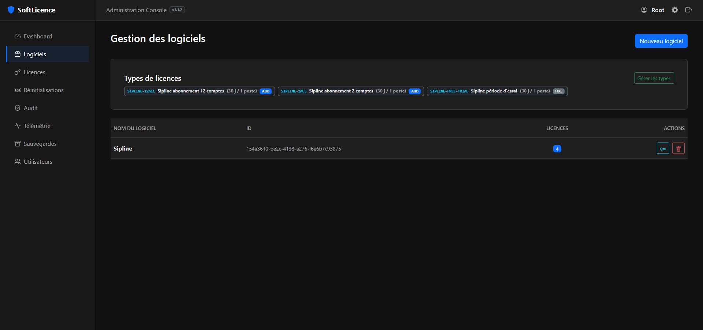
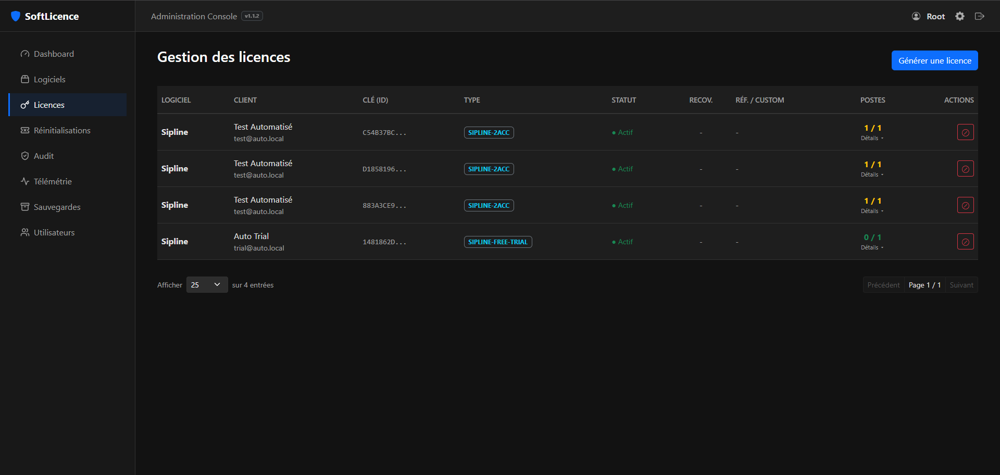
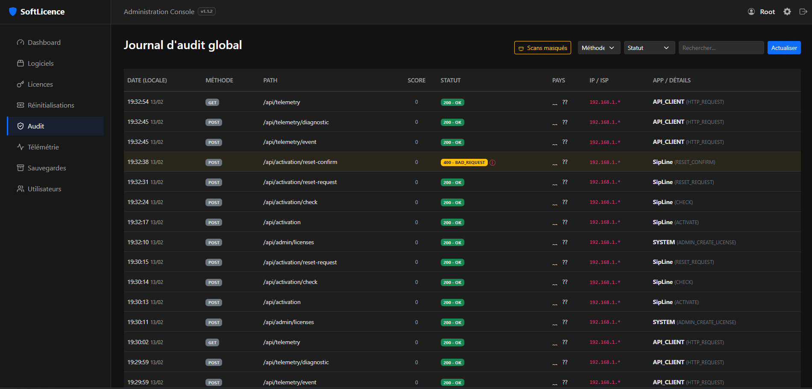
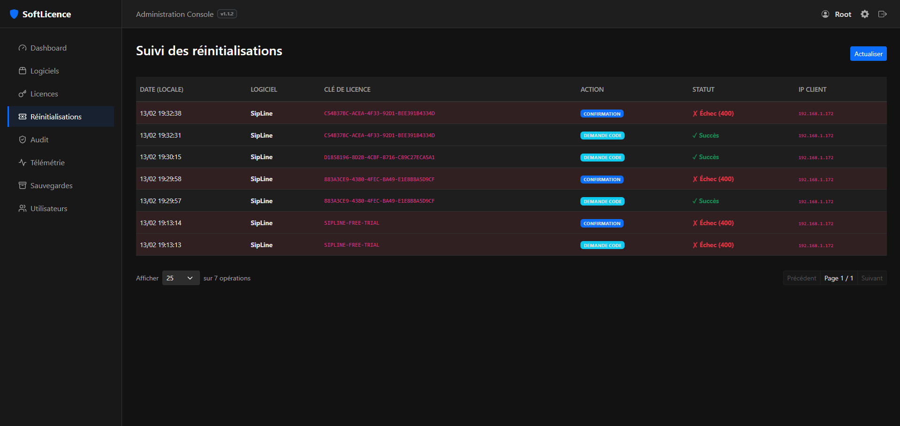

# SoftLicence

**Self-hosted license management platform for .NET WPF applications.**

RSA-4096 cryptographic licensing with hardware fingerprinting, admin dashboard, and built-in security.

[](https://dotnet.microsoft.com/)
[](LICENSE)
[](README.fr.md)


## Features

- **RSA-4096 Signing** - Licenses are cryptographically signed and hardware-locked (HWID fingerprint)
- **Blazor Admin Dashboard** - Manage products, licenses, customers and monitor activity in real-time
- **Subscription & Renewals** - Recurring license types with Stripe/PayPal-ready renewal API
- **Custom Fields (Reference)** - Attach order IDs or internal references to licenses (encrypted in signed file)
- **Auto-Trial Generation** - Let apps self-activate on first launch via magic key or dedicated endpoint
- **Multi-Seat Licensing** - Allow a single license key on multiple machines
- **Telemetry & Analytics** - Track activations, errors and diagnostics from client apps
- **Self-Service Reset** - Customers can unbind their license via email verification
- **Threat Scoring & Auto-Ban** - Automatic IP banning after suspicious activity (brute force, scanning)
- **GeoIP Intelligence** - Every request is enriched with country and ISP data
- **Version Control** - Restrict licenses to specific app versions (e.g. `1.*`, `2.1.0`)
- **Audit Logging** - Full HTTP request logging with performance tracking

## Quick Start

### Docker (recommended)

```bash
# Clone and configure
git clone https://github.com/feelautom/SoftLicence.git
cd SoftLicence

# Set your environment variables and deploy
docker-compose -f docker/docker-compose.yml up --build -d
```

### Local Development

```powershell
# Build the solution
dotnet build src/SoftLicence.sln

# Run the server (http://localhost:5200)
dotnet run --project src/SoftLicence.Server --urls "http://0.0.0.0:5200"
```

### Configuration

All settings are in `src/SoftLicence.Server/appsettings.json` or via environment variables:

| Variable | Description |
|---|---|
| `AdminSettings__Username` | Admin dashboard username |
| `AdminSettings__Password` | Admin dashboard password |
| `AdminSettings__ApiSecret` | API key for admin endpoints |
| `AdminSettings__LoginPath` | Secret URL path for login page |
| `AdminSettings__AllowedIps` | IP whitelist (comma-separated) |
| `SmtpSettings__Host` | SMTP server for email features |

## Architecture

```
SoftLicence/
├── src/
│   ├── SoftLicence.Core       # Crypto engine (RSA-4096, HWID, signing)
│   ├── SoftLicence.Server     # ASP.NET Core 9.0 + Blazor admin UI
│   ├── SoftLicence.UI         # WPF activation window (reusable)
│   ├── SoftLicence.Template   # Starter template for new WPF apps
│   └── SoftLicence.KeyGen     # CLI key pair generator
├── samples/                   # Sample WPF app with Obfuscar
├── docs/                      # Technical documentation (FR)
│   └── en/                    # Technical documentation (EN)
├── docker/                    # Docker deployment files
├── tests/                     # Integration & unit tests
└── scripts/                   # Admin CLI & build scripts
```

## Client Integration

```csharp
protected override async void OnStartup(StartupEventArgs e)
{
    base.OnStartup(e);

    var vm = new LicenseActivationViewModel(PUBLIC_KEY, "MyApp", "https://your-server.com");
    await vm.InitializeAsync();

    if (vm.IsLicensed)
        new MainWindow().Show();
    else
        new Window { Content = new LicenseActivationView { DataContext = vm } }.ShowDialog();
}
```

See the [Protection Guide](docs/en/PROTECTION_GUIDE.md) for a complete step-by-step walkthrough.

## Screenshots

| Dashboard | Products | Licenses |
|---|---|---|
|  |  |  |

| Audit Log | Telemetry | Self-Service Reset |
|---|---|---|
|  |  |  |

## Documentation

| | English | French |
|---|---|---|
| Server & Deployment | [SERVER.md](docs/en/SERVER.md) | [SERVER.md](docs/SERVER.md) |
| Client Integration | [CLIENT.md](docs/en/CLIENT.md) | [CLIENT.md](docs/CLIENT.md) |
| Protection Guide | [PROTECTION_GUIDE.md](docs/en/PROTECTION_GUIDE.md) | [PROTECTION_GUIDE.md](docs/PROTECTION_GUIDE.md) |
| Telemetry API | [TELEMETRY_API.md](docs/en/TELEMETRY_API.md) | [TELEMETRY_API.md](docs/TELEMETRY_API.md) |
| Roadmap | [ROADMAP.md](docs/en/ROADMAP.md) | [ROADMAP.md](docs/ROADMAP.md) |

## API Overview

**Public endpoints** (client apps):
- `POST /api/activation` - Activate a license on a machine
- `POST /api/activation/trial` - Auto-generate a trial license
- `POST /api/activation/reset-request` - Request HWID reset via email
- `POST /api/activation/reset-confirm` - Confirm reset with 6-digit code

**Admin endpoints** (require `X-Admin-Secret` header):
- `POST /api/admin/licenses` - Create a new license
- `GET /api/admin/licenses` - List all licenses
- `POST /api/admin/licenses/{key}/renew` - Renew a subscription license
- `POST /api/admin/products` - Create a new product

## License

Elastic License 2.0 - see [LICENSE](LICENSE) for details.

You are free to use, modify, and self-host this software. You may **not** offer it as a hosted/managed service (SaaS).

## Author

Built by [FeelAutom](https://feelautom.fr) — contact@feelautom.fr
